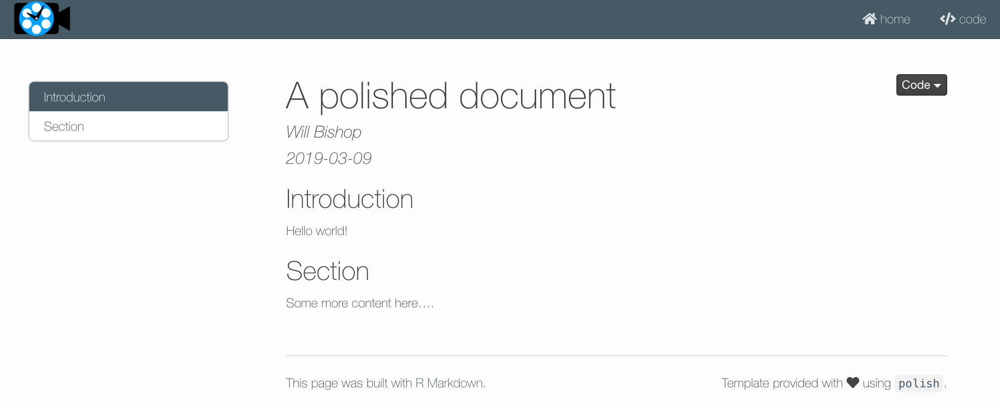

# polish

**/ˈpäliSH/ *verb*: improve, refine, or add the finishing touches to.**

`polish` provides attractive templates to polish up your R content
([RMarkdown](http://rmarkdown.rstudio.com) docs and
[flexdashboards](http://rmarkdown.rstudio.com/flexdashboard/)) for
sharing and potentially publishing to an RStudio
[Connect](https://www.rstudio.com/products/connect/) server.

 

## Steal This Package

This package is meant to be a template package, providing an example of
how to apply custom styling to R content. Feel free to fork the code and
apply your own styling, logo, colors, etc. and build your own document
templates. This is a nice way to provide a coherent look for corporate
branded content or just to have your own personal style.

 

## Installation

You can install the latest version of `polish` from GitHub using the
`remotes` package.

    # install.packages("remotes")
    remotes::install_github("wcmbishop/polish")

 

## Getting Started

Get started with the `polish` package by reading the introduction
vignette - run the command below in R to access this. You can also find
package documentation by calling `help(package = polish)` to show all
functions or with `?function_name` to show an individual function (e.g.
`?collapsible_panel`).

    vignette("introduction", package = "polish")
