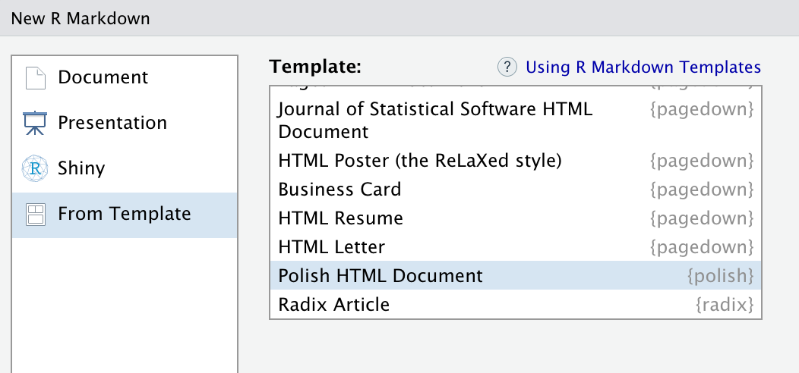

The `polish` packages aims to make your R content shiny and beautiful. The primary method for doing this is to provide attractive templates for common R content formats ([RMarkdown](http://rmarkdown.rstudio.com) and [flexdashboards](http://rmarkdown.rstudio.com/flexdashboard/)). For starters, the package provides the `polish_html` RMarkdown template described below. We'd like to add more templates over time that provide similar styling and features.

<br>

## Polish HTML Document

The `polish_html` is a styled R Markdown-to-HTML rendering function that builds on the default `rmarkdown::html_document` function. You can apply this report style to any R Markdown document by setting the `output` field to `polish::polish_html` in the initial Rmd header section, as shown below.

```
---
title: "Untitled"
author: "Your Name"
date: "`r Sys.Date()`"
output: polish::polish_html
---
```

See below for a screenshot of a "knitted" `polish_html` document. You get some nice css styling, along with default options for showing a table-of-contents and code-folding. If you add values for the inputs `source` (for source code) and `contact` (for email contact), then you will also get some navbar links for those things. You can also define a `home` link to some homepage - this is meant to provide a breadcrumb to an RStudio Connect homepage when a published document is opened in "solo" mode on the server.


### Polish HTML Markdown Template

Installing `polish` will also install a template for easily starting a new `polish_html` RMarkdown document. Create a new report from this template in RStudio by going to *File --> New File --> R Markdown...* in the menu-bar. Then in the pop-up, go to the "*From Template*" tab and pick "*Polish HTML Document*". This will create a new .Rmd document with some default inputs at the top.



